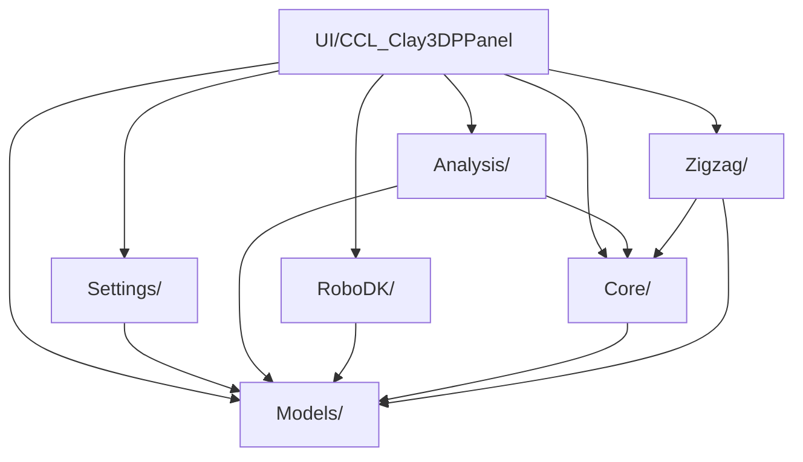
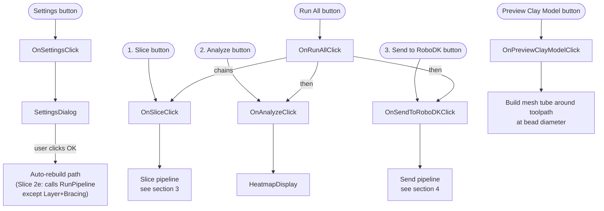
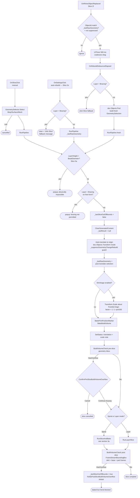
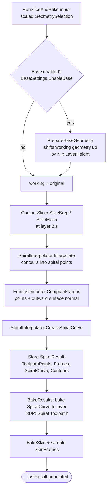
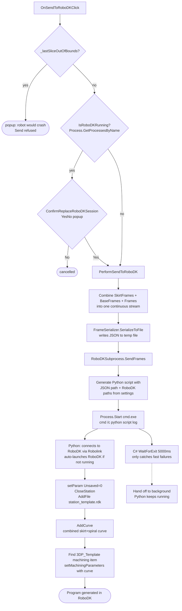
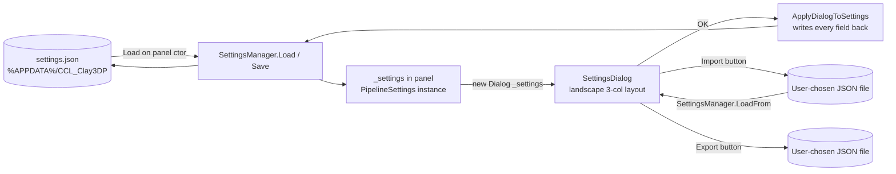
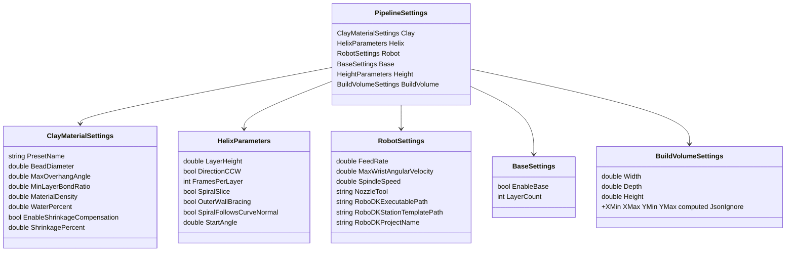

# CCL_Clay3DP — Architecture overview

Last refreshed 2026-05-03 against `main` at `v1.2.0-alpha` (merge commit `b8e2be9`). Reflects all settings-ui work shipped in that release: slices 1, 2a, 2b, 2d, 2e, 2f, 3, 5a, 5b, 5c.

This document is meant to be printed and pinned next to the workstation. Each diagram is a Mermaid block — render in VS Code (Mermaid extension), GitHub/GitLab, or paste into <https://mermaid.live> to view/export PNG.

---

## 1. Folder map

```
CCL_Clay3DP/
├── UI/
│   ├── CCL_Clay3DPPanel.cs        # The dockable panel — every user-visible button lives here
│   └── ...
├── Settings/
│   ├── SettingsDialog.cs          # Modal dialog with Material / Tool / Toolpath / Robot / Build Volume
│   └── SettingsManager.cs         # JSON load/save (settings.json); also Import/Export to user file
├── Models/                         # Pure data classes — no behavior, no dependencies on other layers
│   ├── PipelineSettings.cs        # Root settings record (composes the others)
│   ├── ClayMaterialSettings.cs    # Bead diameter, max overhang, density, water %, shrinkage comp
│   ├── BaseSettings.cs            # Multi-layer raft (Issue #10)
│   ├── RobotSettings.cs           # Feed rate, spindle, nozzle, RoboDK paths
│   ├── Parameters.cs              # GeometrySelection, BuildVolumeSettings, HelixParameters, HeightParameters
│   └── ClayPresets.cs             # Porcelain / Stoneware / Earthenware presets
├── Core/                           # Geometry pipeline primitives
│   ├── GeometrySelector.cs        # Rhino object picker (Brep/Surface/Mesh)
│   ├── GeometryCurvature.cs       # IsRuled() — bracing-compatibility check
│   ├── ContourSlicer.cs           # Brep/Mesh → planar contour curves at layer Z's
│   ├── SpiralInterpolator.cs      # Contours → spiral toolpath points
│   ├── FrameComputer.cs           # Toolpath points → robot Plane frames (with normals)
│   ├── SkirtBuilder.cs            # Bottom contour + offset → skirt curve + frames
│   └── ThinwallSpiralResult.cs    # SpiralResult — the cached output of one slice
├── Analysis/
│   ├── PrintabilityAnalyzer.cs    # Per-frame scoring (overhang, bond, curvature, taper, wrist)
│   ├── PrintabilityResult.cs      # FrameScore, AnalysisChannel enum, PrintabilityResult
│   ├── HeatmapDisplay.cs          # Visualizes per-frame scores on the geometry mesh
│   └── BuildVolumeCheck.cs        # Slice 2d — bbox vs build volume overflow detection
├── RoboDK/
│   ├── FrameSerializer.cs         # SpiralResult.Frames → JSON for the Python script
│   └── RoboDKSubprocess.cs        # Runs the Python script via cmd.exe; Python connects to RoboDK
└── Zigzag/                         # Outer Wall Bracing (Layer Slice mode)
    └── ...
```

**Dependency direction (lower depends on higher, never the reverse):**



**Models has no dependencies** — it's the leaf. Anything circular here is a bug.

---

## 2. The panel — every user-visible button



**Key gates that block buttons / pipeline runs:**

- `_settingsReviewed` — Slice/Analyze/Send/RunAll/Preview are disabled until the user opens Settings at least once per session. Avoids users running with stale defaults.
- `_lastSliceOutOfBounds` — set by post-slice build-volume check (Slice 2d). When true, Send shows a "robot would crash" popup and refuses to run. RunAll short-circuits past Analyze + Send.
- **Layer height ≤ bead diameter** (Slice 5a) — checked at the top of RunPipeline (and again at the top of OnPreviewClayModelClick). Layer height larger than bead diameter is physically impossible (clay can't span a vertical gap larger than itself); rejected with an explanatory popup before any state changes.
- **Outer Wall Bracing requires ruled geometry** — checked inside RunPipeline. Layer mode + bracing on free-form geometry is rejected before any state changes.

---

## 3. Slice pipeline (RunPipeline)

`RunPipeline(GeometrySelection)` is the single entry point — three call sites feed into it. Don't sneak slice logic into a single caller; modify RunPipeline so all three paths get it.



### 3a. Spiral runner — RunSliceAndBake



`RunLayerSlice` is similar but produces per-layer closed loops instead of a continuous spiral, and may also generate Outer Wall Bracing zigzags via the Zigzag/ module.

---

## 4. Send-to-RoboDK pipeline



**Cold-start launch behaviour:** `Robolink()` auto-launches RoboDK if it isn't running. As of v1.2.0-alpha testing, first-send works reliably; an earlier-flagged race condition (Python continuing past `setParam`/`CloseStation` before RoboDK was ready) was not reproducible at release time and is not actively tracked. If first-send "succeeds" silently with no RoboDK window appearing, capture `%TEMP%/ccl_clay3dp_TIMESTAMP.log` (path is logged on each send) — the script's stdout/stderr there will show exactly which API call hung.

---

## 5. Settings flow



### PipelineSettings composition



---

## 6. Cached state in the panel — fields that span method calls

| Field | Type | Set by | Read by | Purpose |
|---|---|---|---|---|
| `_settings` | `PipelineSettings` | ctor (`Load`), `OnSettingsClick` | every handler | live settings used by the pipeline |
| `_settingsReviewed` | `bool` | `OnSettingsClick` (first OK) | button enable gate | force user through Settings before slicing |
| `_lastResult` | `SpiralResult` | runners (`RunSliceAndBake`, `RunLayerSlice`) | `OnAnalyzeClick`, `OnSendToRoboDKClick`, post-slice check | toolpath cache for Analyze + Send |
| `_lastGeometry` | `GeometrySelection` | runners | `OnAnalyzeClick` (heatmap), `OnSettingsClick` (marker re-bake) | scaled selection used by heatmap display |
| `_lastRawGeometry` | `GeometrySelection` | `RunPipeline` (post-translate, pre-shrinkage) | `OnSettingsClick` auto-rebuild + Slice 2f geometry-change handler + filter | input for full-pipeline regenerate after settings/geometry change |
| `_lastSliceOutOfBounds` | `bool` | post-slice check (Slice 2d) | `OnSendToRoboDKClick` (block), `OnRunAllClick` (short-circuit) | gate to prevent robot crash |
| `_lastTranslationNote` | `string` | RunPipeline | `WithTranslationNote` (consumed once) | stash translation+scale message so completion status can append it |
| `_hasSentToRoboDK` | `bool` | `PerformSendToRoboDK` (on success) | `OnSettingsClick` (warn-stale trigger) | tracks whether RoboDK is in the workflow this session |
| `_gatedControls` | `List<Control>` | ctor (button list) | `OnSettingsClick` (unlock on first review) | controls disabled until `_settingsReviewed` |
| `_suppressGeometryChangeRebuild` | `bool` | wraps `doc.Objects.Transform` in RunPipeline | `OnRhinoObjectReplaced` handler | recursion guard (Slice 2f) — prevents our own auto-translate from re-firing the geometry-change rebuild → infinite loop |
| `_rebuildDebounce` | `UITimer` | ctor (Interval = 0.5s) | `OnRhinoObjectReplaced` (Start/Stop) → `OnRebuildDebounceElapsed` | Slice 2f — coalesces a continuous Gumball drag into ONE rebuild on release |

---

## 7. Where to look when fixing X

| Symptom | First file to open |
|---|---|
| Settings dialog field added/changed | `Settings/SettingsDialog.cs` + `Models/<the relevant settings class>.cs` + `Models/PipelineSettings.cs` if a new top-level group |
| New settings preset | `Models/ClayPresets.cs` |
| Slice pipeline orchestration | `UI/CCL_Clay3DPPanel.cs` → `OnSliceClick` / `RunPipeline` (Slice 2e) |
| Spiral toolpath generation | `Core/SpiralInterpolator.cs` + `Core/FrameComputer.cs` |
| Layer mode + bracing | `UI/CCL_Clay3DPPanel.cs` → `RunLayerSlice` + `Zigzag/` |
| Build volume / part-fits-cell logic | `Analysis/BuildVolumeCheck.cs` + post-slice block in `OnSliceClick` |
| Heatmap colors | `Analysis/HeatmapDisplay.cs` (the per-frame scoring is in `Analysis/PrintabilityAnalyzer.cs` but only `HeatmapDisplay` calls it currently) |
| RoboDK send / launch issues | `RoboDK/RoboDKSubprocess.cs` (Python script generator) + `UI/CCL_Clay3DPPanel.cs` → `PerformSendToRoboDK` |
| Status/detail labels | `UI/CCL_Clay3DPPanel.cs` → `SetStatus`, `SetDetail`, `WithTranslationNote` |

---

## 8. Recent slice history (context for understanding decisions)

All shipped in v1.2.0-alpha (2026-05-03).

| Slice | What landed | Why it matters here |
|---|---|---|
| 1 | Landscape 3-col SettingsDialog layout, nozzle moved to Tool group, Robot/Printer→Robot/Extruder | Dialog structure mirrors the conceptual sections in this doc |
| 2a | `WaterPercent` field (recorded only) | New Material section field; downstream behaviour deferred until lab experiments produce a curve |
| 2b | Shrinkage compensation toggle + pipeline scale | The reason `_lastRawGeometry` exists — compounding shrinkage on auto-rebuild was the bug |
| 2d | Build-volume check + Send block + popups | Catches oversized scaled parts before they crash the robot. New `Analysis/BuildVolumeCheck.cs` |
| 2e | `RunPipeline` extraction + Settings auto-rebuild via full pipeline | Fixes shrinkage not refreshing on settings change. Single entry point for all three pipeline triggers |
| 2f | `RhinoDoc.ReplaceRhinoObject` subscription + 500 ms debounce + recursion guard | Auto-rebuild on Gumball edits — no need to click Slice after rescaling a part |
| 3 | `BuildVolumeSettings` Width × Depth × Height + `[JsonExtensionData]` migration | Simpler dialog (3 fields not 5); JSON migration pattern for future schema changes |
| 5a | Layer height ≤ bead diameter rejected with popup | Physical-feasibility gate at top of RunPipeline + Preview |
| 5b | Skirt + Base layers added to Preview Clay Model source | Preview now reflects the full clay deposition, not just the part body |
| 5c | Elliptical pipe in Preview when layer < bead (W = D²/H, area-conserved) | New `BuildEllipticalTube` helper; matches the physical reality of a squashed bead |

Pending after v1.2.0-alpha:

- **Slice 2c** — calibration database (CSV in `CCL_Clay3DP/Materials/`, schema covers shrinkage + water-% experiments + nozzle observations).
- **Slice 4** — Tool/Nozzle section expansion. Aligns with GitLab #12 (drop-down for various nozzles).
- **Chamotte %** field on Material section — supplier-label data, affects max wall height + nozzle wear.
- **RoboDK launch reliability** — closed at release time (self-resolved during testing); track recurrence via the temp log path.
